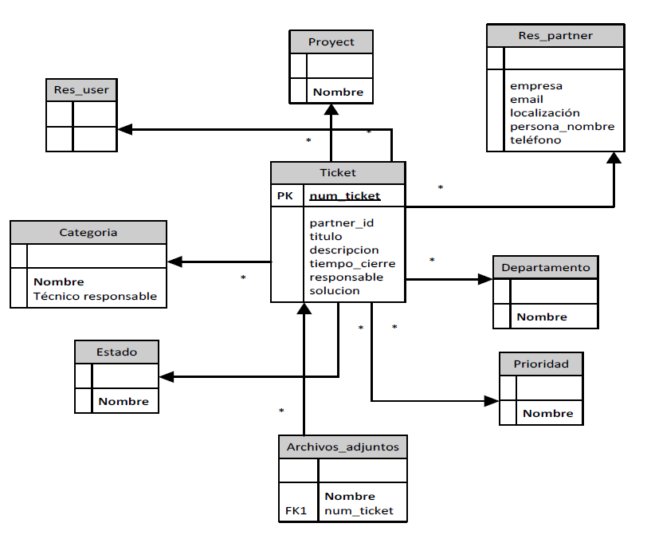

# HELP DESK ODOO

El objetivo de esta tarea es la elaboración de un sistema de gestión de incidencias. Normalmente estas incidencias vienen dadas 
como tickets creados por los clientes de una empresa con la finalidad de resolver un problema o una duda concreta. 
La administración y gestión de los tickets puede hacerse esencialmente mediante el software Zammad o en el sistema ERP Odoo. 
La tarea principal será la elaboración de dicho sistema de gestión de incidencias desde Odoo, para lo cual se creará un módulo 
independiente (helpdesk_bytacora). La integración de Zammad con Odoo, se hará de tal manera que se puedan tener sincronizados los
tickets en ambos sitios, por lo que se necesitará otro módulo que se encargue de la importación desde Zammad a Odoo 
(base_external_import_zammad). 

# Módulo Help Desk

El módulo contempla 3 tipos de perfiles diferentes:
  • Usuario: Usuario de una empresa (puede crear tickets)
  • Técnico responsable: (puede crear, resolver y reasignar tickets)
  • Administrador: (puede crear, reasignar, resolver y eliminar tickets)
  
La representación de los datos sigue un modelo entidad-relación. El elemento principal del modelo es el “Ticket”. 
La siguiente figura representa una primera representación de la organización de los datos y de los principales campos de los que se
ha de llevar un control por cada ticket que se cree. Ya que no es una versión final, este modelo es ampliamente extensible según 
crezcan las necesidades futuras.

FUNCIONALIDADES PARA CADA ROL

  Usuario
  • Puede comunicar una nueva incidencia. Tiene dos posibles vías:
    - Mediante Odoo
    - Mediante correo electrónico
  En ambos casos los datos a introducir necesarios son “Asunto”, “Descripción” y “Archivos adjuntos”.
  • Buscar problemas anteriores reportados por el propio usuario, con un amplio rango de filtros para poder encontrar el problema deseado rápidamente.
  • Intercambiar notas con el técnico asignado ante posibles dudas.
  • Consultar una incidencia reportada, pudiendo ver el estado de la misma, así como las posibles notas intercambiadas con el técnico asignado.
  • Para incidencias cerradas se puede ver la solución final, valorar la atención recibida o incluso reabrir la propia incidencia.
  
  Técnico responsable
  • Visualizar la información del usuario reportador de la incidencia: nombre, empresa, localización, correo y teléfono.
  • Asunto, descripción y archivos adjuntos son datos introducidos por el usuario reportador que no se modifican, pero tienen la posibilidad de editar los siguientes campos: “Categoría”, “Proyecto”, “Prioridad” y “Departamento”.
  • Posibilidad de: intercambiar notas con el usuario reportador, reasignar el ticket a otro técnico, ofrecer una solución a la incidencia y reabrir una incidencia cerrada.
  • Visualizar otras incidencias (no propias) y de distintos tipos (abiertas, sin mirar, prioridad alta, por fecha…)
  
  Administrador
  • Tiene los mismos privilegios que los técnicos responsables, y además puede borrar cualquier ticket deseado.
  
 # Módulo Importación de Datos
  
Existe la posibilidad de gestionar los tickets mediante Zammad. Debido a esto, puede ser interesante la importación de tickets desde 
Zammad a Odoo, de tal manera que se puedan gestionar desde el propio Odoo. Esto se consigue con el módulo base_external_import_zammad. 
El funcionamiento es el siguiente:
Depende de base_external_dbsource. Se creará por tanto en Configuración -> Técnico -> Database Sources la conexión correspondiente 
con la base de datos donde se almacena la información correspondiente a las incidencias en Zammad.
Se crea un menú en Configuración -> Técnico -> Zammad Tickets. En este apartado se obtienen los datos necesarios de los tickets 
de Zammad para crear (o actualizar) con dicha información nuevos registros en los tickets de Odoo. Existe la posibilidad de editar 
la query para cambiar los datos que se quieren traer; sin embargo, un cambio en esta consulta conllevará añadir/quitar código en 
base_external_import.py. También se puede ejecutar la importación manualmente mediante un botón (“Run import”).
Por último, en Configuración -> Técnico -> Automatización -> Acciones planificadas se crea una tarea programada para que 
la importación de los datos se haga cada x min.
